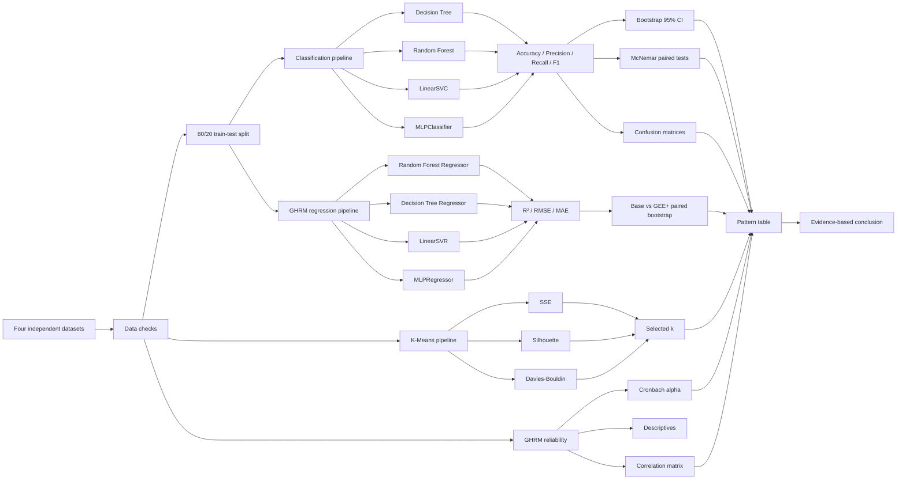
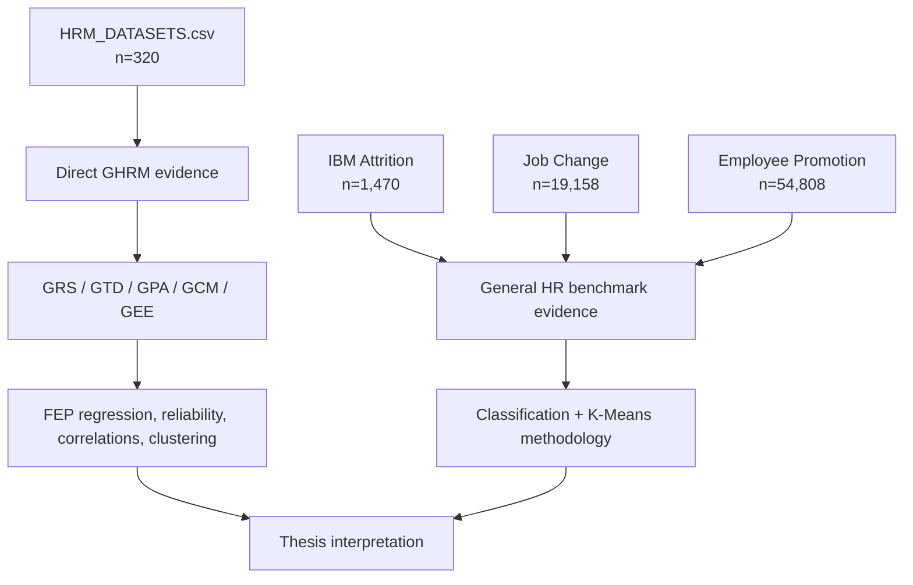
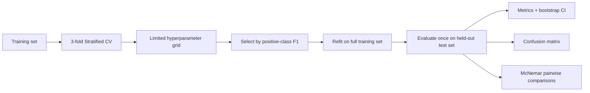
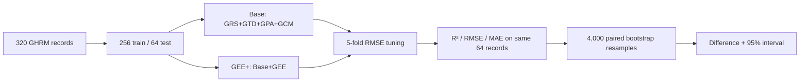
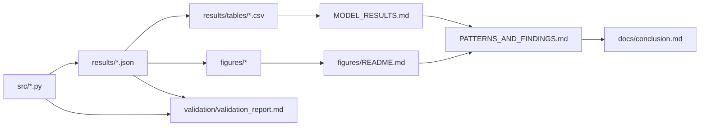

# Analysis flow and evidence chain

The following diagrams summarize how the repository moves from raw data to reported findings. They are documentation diagrams, not substitutes for the fitted model figures.

## End-to-end workflow

## Dataset-role separation

The four datasets are not merged record-by-record. The second diagram is included specifically to prevent a reader from interpreting the three benchmark targets as direct Green HRM measures.

## Classification decision logic

## GHRM Base vs GEE+ logic

## Evidence chain used in the repository

