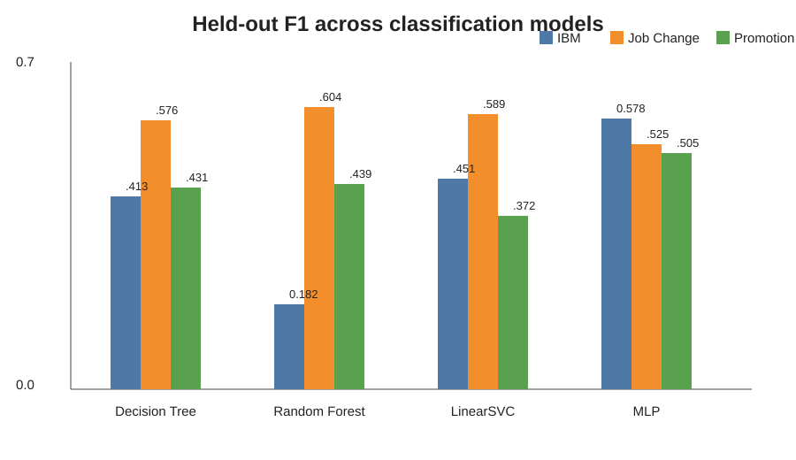
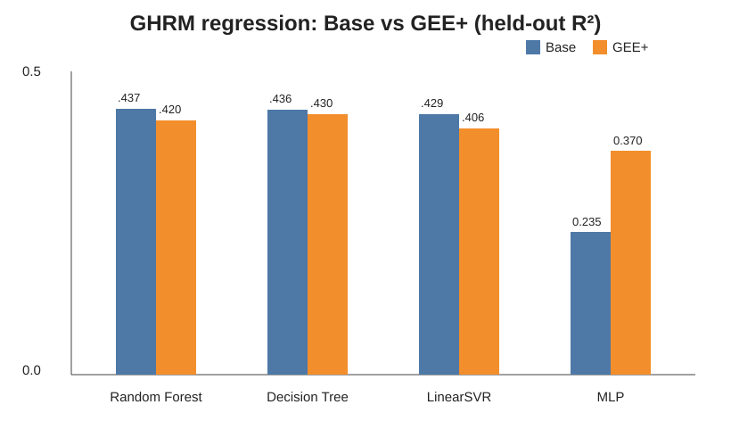
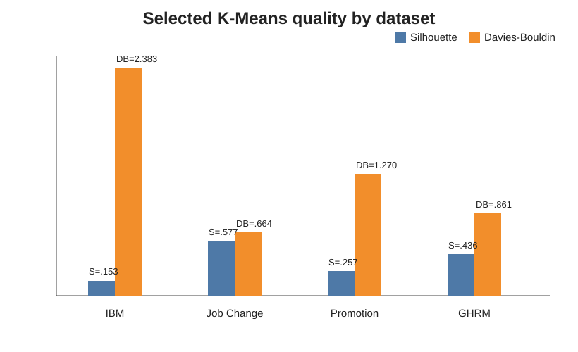
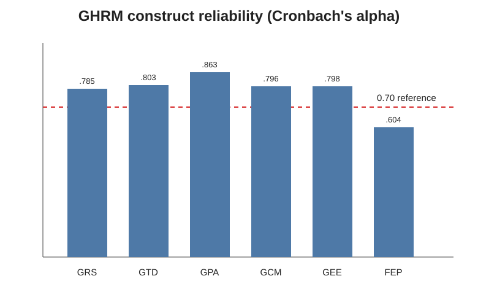
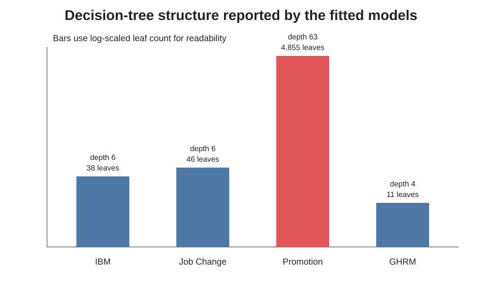

# Reviewer-facing summary figures

These SVG figures are compact visual summaries derived directly from the committed numerical results in `results/*.json`. They do **not** replace the model-generated PNG artifacts listed in `MANIFEST.md`; they are an additional navigation layer for a reviewer.

## Classification F1

Source values: `results/ibm_attrition_classification_report.json`, `results/job_change_classification_report.json`, and `results/promotion_classification_report.json`. The figure emphasizes F1 because all three classification tasks are imbalanced and accuracy alone can obscure minority-class performance.

## GHRM Base vs GEE+

Source values: `results/ghrm_full_report.json`. Random Forest, Decision Tree and LinearSVR have slightly lower point R² after adding GEE; MLP has a higher point R². The paired bootstrap intervals in the JSON report should be used before claiming a statistically reliable improvement.

## K-Means quality

Source values: the three benchmark K-Means reports plus `results/ghrm_full_report.json`. Job Change has the strongest selected separation by the combination of higher Silhouette and lower Davies-Bouldin. IBM Attrition has weak separation and should be interpreted cautiously.

## GHRM reliability

Source values: `results/ghrm_reliability_report.json`. GRS, GTD, GPA, GCM and GEE exceed the common 0.70 reference. FEP is 0.6043 and is therefore reported as a limitation rather than concealed.

## Decision-tree complexity

Source values: the committed classification reports and `results/ghrm_full_report.json`. Promotion's selected unrestricted tree is far larger than the other trees (depth 63, 4,855 leaves), which is explicitly treated as an overfitting/interpretability warning.

## Evidence rule

Whenever a summary figure and a JSON report are both available, the JSON report is the authoritative numerical source. The SVG is a human-readable visualization of those same committed values.