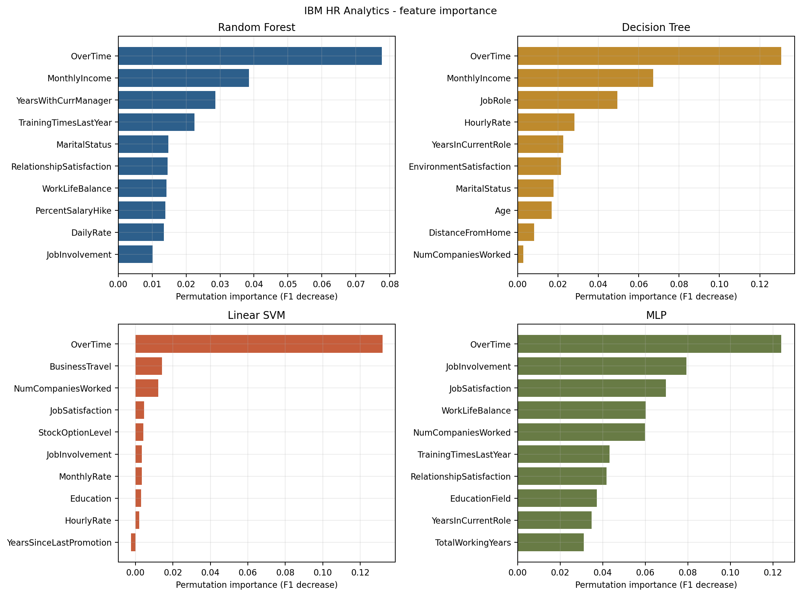
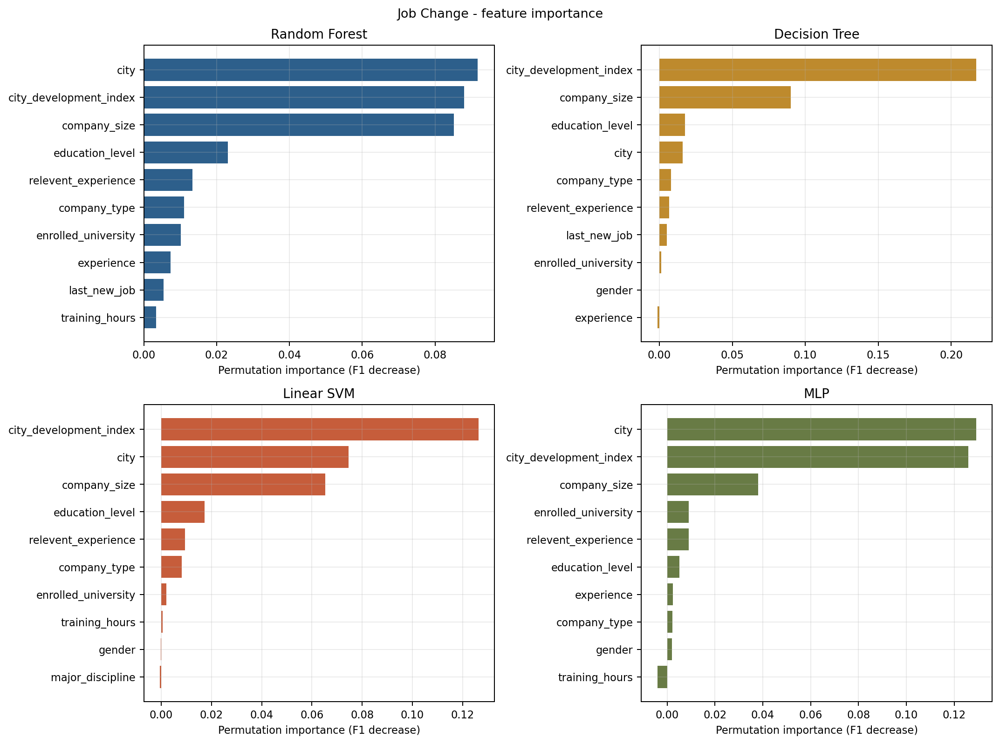
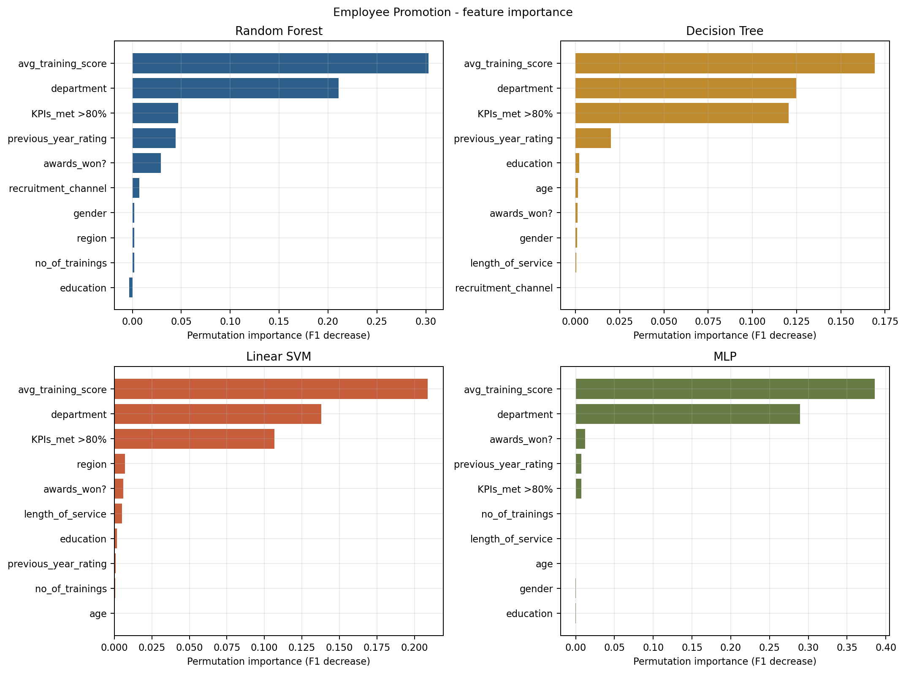
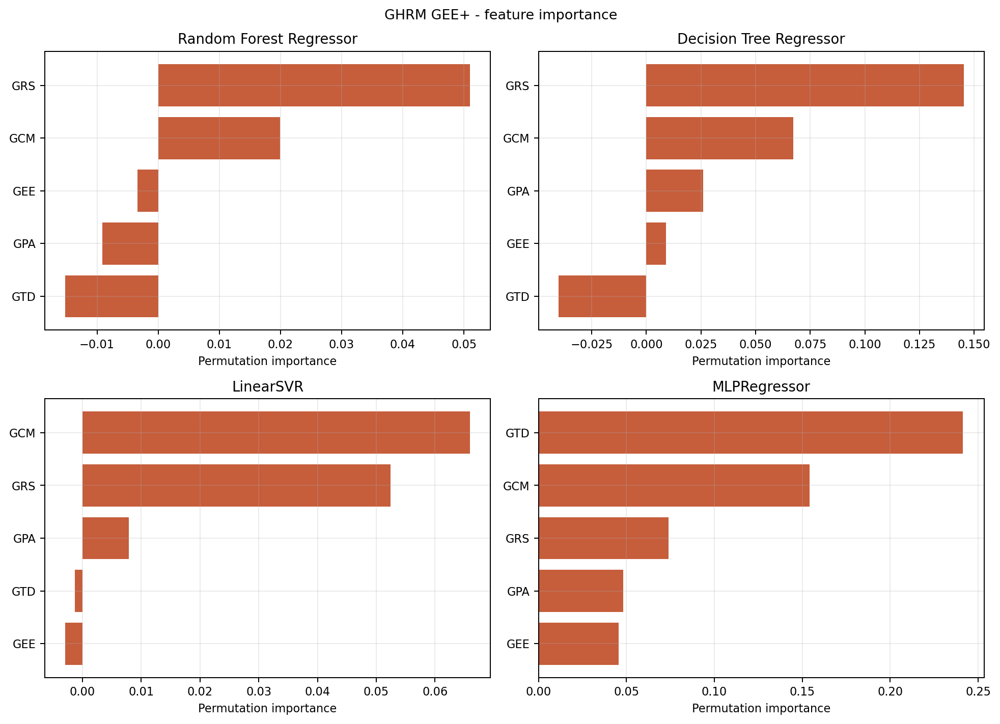
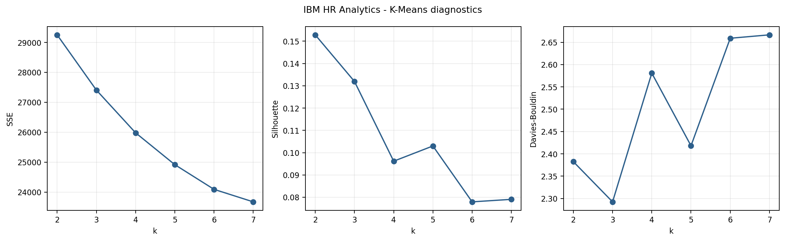
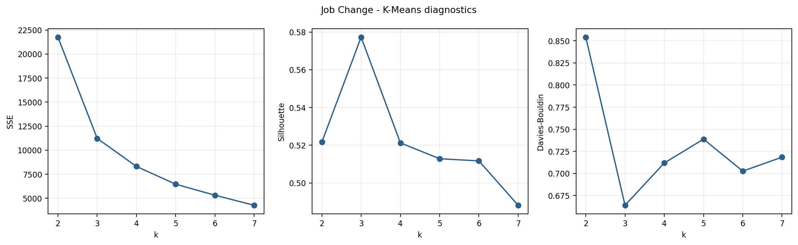
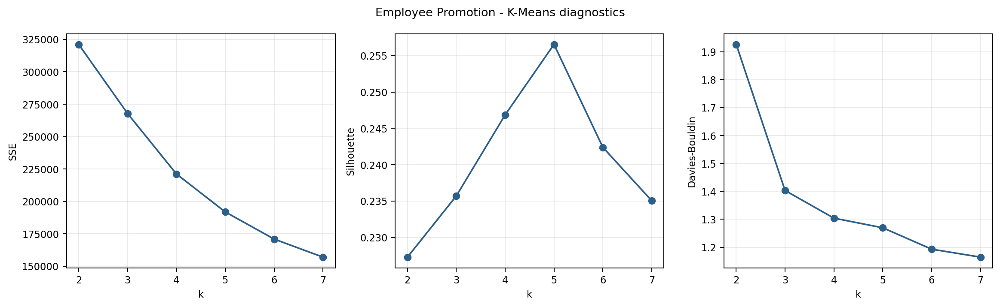
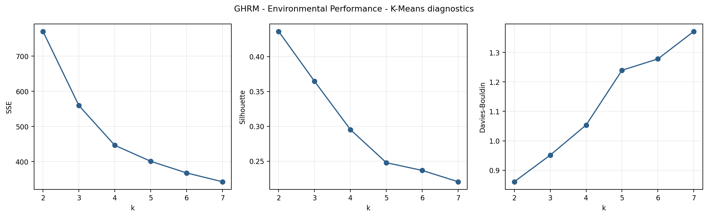

# گزارش اجرای نهایی تحلیل منابع انسانی

این گزارش مستقیماً با اجرای `python run_all.py` ساخته شده است. هیچ عددی از فایل پایان نامه به نتایج کد تزریق نشده است. مسیر هر عدد از فایل داده، تقسیم آموزش و آزمون، پارامتر مدل و فایل پیش بینی قابل پیگیری است.

## حدود پژوهش و نقش چهار دیتاست

دیتاست GHRM تحلیل اصلی مدیریت منابع انسانی سبز است و متغیرهای GRS، GTD، GPA، GCM، GEE و FEP را مستقیماً دارد. سه دیتاست دیگر تحلیل های مستقل و تکمیلی منابع انسانی هستند و برای ترک خدمت، تغییر شغل و ارتقا استفاده شده اند. نتایج آن سه دیتاست شاهد مستقیم رفتار سبز یا پایداری شرکت نیستند و با دیتاست GHRM ادغام نشده اند. این پروژه هیچ داده ای از دیجی کالا ندارد.

| Display_Name | Role | Rows | Raw_Columns | Target | SHA256 |
| --- | --- | --- | --- | --- | --- |
| IBM HR Analytics | supplementary HR analysis | ۱,۴۷۰ | ۳۵ | Attrition | `a5c31e38bd7fafc9bc333884eb181b06b41b8e5e488e8f7ccb27199fb3be7659` |
| Job Change | supplementary HR analysis | ۱۹,۱۵۸ | ۱۴ | target | `8b78da3482032500df40d5359c36ba4a59e28ccd6fc272b050dcf6dee37f114c` |
| Employee Promotion | supplementary HR analysis | ۵۴,۸۰۸ | ۱۴ | is_promoted | `3d7b679b3ba36d1cad25d4e0ea40bc84e5ac741c45e9c878d72adc3db74a984c` |
| GHRM - Environmental Performance | main Green HRM analysis | ۳۲۰ | ۳۳ | FEP items | `ac5c0005d3492aa664ec4d290e027f04a778241d3ce6195e10c5f87aebc65203` |

نام تمام ستون ها، نوع داده، تعداد مقادیر گمشده و تعداد مقادیر متمایز در [`data/column_dictionary.csv`](data/column_dictionary.csv) ثبت شده است. دامنه و فراوانی های حساس فقط در اجرای محلی قرار می گیرند.

## مراحل انجام کار

| Step | Action | Saved_Evidence |
| --- | --- | --- |
| ۱ | ثبت هویت داده | هش SHA-۲۵۶، تعداد ردیف و ستون |
| ۲ | کنترل کیفیت | مقادیر گمشده، تکراری و کامل بودن هدف |
| ۳ | پیش پردازش | جایگذاری فقط در داده آموزش، کدگذاری و مقیاس بندی |
| ۴ | تقسیم داده | ۸۰ درصد آموزش و ۲۰ درصد آزمون با بذر ۴۲ |
| ۵ | تنظیم مدل | اعتبارسنجی متقاطع و انتخاب پارامتر روی آموزش |
| ۶ | ارزیابی نهایی | آزمون نگه داشته شده، ماتریس و بازه اطمینان |
| ۷ | تفسیر مدل | اهمیت متغیرها، ساختار درخت و ضرایب |
| ۸ | خوشه بندی | بررسی k از ۲ تا ۷ و پروفایل خوشه ها |

پیش پردازش داخل Pipeline انجام شده است؛ بنابراین میانه، مد، کدگذاری و مقیاس بندی فقط از داده آموزش یاد گرفته می شوند. معیار تنظیم طبقه بندی F1 کلاس مثبت و معیار تنظیم رگرسیون RMSE است.

## نتایج مدل های طبقه بندی

### IBM HR Analytics

| Model | Accuracy | Precision | Recall | F1 | CV_Best_F1 |
| --- | --- | --- | --- | --- | --- |
| Random Forest | ۰.۸۳۳۳ | ۰.۴۳۷۵ | ۰.۱۴۸۹ | ۰.۲۲۲۲ | ۰.۳۹۳۷ |
| Decision Tree | ۰.۷۸۵۷ | ۰.۳۶۶۷ | ۰.۴۶۸۱ | ۰.۴۱۱۲ | ۰.۳۹۷۵ |
| Linear SVM | ۰.۷۵۱۷ | ۰.۳۴۸۸ | ۰.۶۳۸۳ | ۰.۴۵۱۱ | ۰.۴۸۶۲ |
| MLP | ۰.۸۷۷۶ | ۰.۷۰۳۷ | ۰.۴۰۴۳ | ۰.۵۱۳۵ | ۰.۵۳۷۷ |

در این تفکیک، بیشترین F1 مربوط به **MLP** با مقدار **۰.۵۱۳۵** است. این نتیجه فقط درباره متغیر هدف `Attrition` است و سنجش مستقیم GHRM نیست.

[Random Forest](classification/ibm/random_forest/model_diagnostics.json): پارامترها، پیش بینی آزمون، ماتریس، اهمیت متغیرها و خروجی تنظیم مدل

[Decision Tree](classification/ibm/decision_tree/model_diagnostics.json): پارامترها، پیش بینی آزمون، ماتریس، اهمیت متغیرها و خروجی تنظیم مدل

[Linear SVM](classification/ibm/linear_svm/model_diagnostics.json): پارامترها، پیش بینی آزمون، ماتریس، اهمیت متغیرها و خروجی تنظیم مدل

[MLP](classification/ibm/mlp/model_diagnostics.json): پارامترها، پیش بینی آزمون، ماتریس، اهمیت متغیرها و خروجی تنظیم مدل

### Job Change

| Model | Accuracy | Precision | Recall | F1 | CV_Best_F1 |
| --- | --- | --- | --- | --- | --- |
| Random Forest | ۰.۷۶۲۰ | ۰.۵۱۵۵ | ۰.۷۴۷۶ | ۰.۶۱۰۳ | ۰.۵۸۴۱ |
| Decision Tree | ۰.۷۴۷۴ | ۰.۴۹۵۴ | ۰.۷۳۹۳ | ۰.۵۹۳۳ | ۰.۵۶۶۴ |
| Linear SVM | ۰.۷۴۳۷ | ۰.۴۹۰۶ | ۰.۷۳۶۱ | ۰.۵۸۸۸ | ۰.۵۷۱۲ |
| MLP | ۰.۷۸۳۷ | ۰.۵۶۸۰ | ۰.۵۵۰۸ | ۰.۵۵۹۳ | ۰.۵۱۷۶ |

در این تفکیک، بیشترین F1 مربوط به **Random Forest** با مقدار **۰.۶۱۰۳** است. این نتیجه فقط درباره متغیر هدف `target` است و سنجش مستقیم GHRM نیست.

[Random Forest](classification/job_change/random_forest/model_diagnostics.json): پارامترها، پیش بینی آزمون، ماتریس، اهمیت متغیرها و خروجی تنظیم مدل

[Decision Tree](classification/job_change/decision_tree/model_diagnostics.json): پارامترها، پیش بینی آزمون، ماتریس، اهمیت متغیرها و خروجی تنظیم مدل

[Linear SVM](classification/job_change/linear_svm/model_diagnostics.json): پارامترها، پیش بینی آزمون، ماتریس، اهمیت متغیرها و خروجی تنظیم مدل

[MLP](classification/job_change/mlp/model_diagnostics.json): پارامترها، پیش بینی آزمون، ماتریس، اهمیت متغیرها و خروجی تنظیم مدل

### Employee Promotion

| Model | Accuracy | Precision | Recall | F1 | CV_Best_F1 |
| --- | --- | --- | --- | --- | --- |
| Random Forest | ۰.۹۱۳۴ | ۰.۴۹۱۱ | ۰.۴۴۴۳ | ۰.۴۶۶۶ | ۰.۴۵۹۳ |
| Decision Tree | ۰.۷۳۸۷ | ۰.۲۳۰۹ | ۰.۸۸۶۵ | ۰.۳۶۶۴ | ۰.۳۶۶۰ |
| Linear SVM | ۰.۷۵۸۴ | ۰.۲۳۸۷ | ۰.۸۳۸۳ | ۰.۳۷۱۶ | ۰.۳۶۹۴ |
| MLP | ۰.۹۴۳۱ | ۰.۹۷۲۶ | ۰.۳۴۱۵ | ۰.۵۰۵۵ | ۰.۴۹۴۷ |

در این تفکیک، بیشترین F1 مربوط به **MLP** با مقدار **۰.۵۰۵۵** است. این نتیجه فقط درباره متغیر هدف `is_promoted` است و سنجش مستقیم GHRM نیست.

[Random Forest](classification/promotion/random_forest/model_diagnostics.json): پارامترها، پیش بینی آزمون، ماتریس، اهمیت متغیرها و خروجی تنظیم مدل

[Decision Tree](classification/promotion/decision_tree/model_diagnostics.json): پارامترها، پیش بینی آزمون، ماتریس، اهمیت متغیرها و خروجی تنظیم مدل

[Linear SVM](classification/promotion/linear_svm/model_diagnostics.json): پارامترها، پیش بینی آزمون، ماتریس، اهمیت متغیرها و خروجی تنظیم مدل

[MLP](classification/promotion/mlp/model_diagnostics.json): پارامترها، پیش بینی آزمون، ماتریس، اهمیت متغیرها و خروجی تنظیم مدل

## آزمون McNemar

آزمون McNemar پیش بینی های دو مدل روی همان رکوردهای آزمون را مقایسه می کند. ستون های b01 و b10 تعداد موارد اختلاف دو مدل هستند. روش دقیق دو جمله ای برای تعداد اختلاف کمتر از ۲۵ و تقریب کای دو با تصحیح پیوستگی برای نمونه های بزرگ تر استفاده شده است. جدول کامل هر شش مقایسه برای هر دیتاست در [`tables/mcnemar.csv`](tables/mcnemar.csv) قرار دارد.

## تحلیل اصلی GHRM و پیش بینی FEP

در مدل پایه، GRS، GTD، GPA و GCM پیش بین هستند. در تحلیل GEE+، متغیر GEE نیز اضافه شده است. علاوه بر آزمون ۲۰ درصدی، برای بررسی محدودیت حجم ۳۲۰ رکورد، عملکرد مدل نهایی در اعتبارسنجی متقاطع تکرارشونده ۵×۵ نیز ثبت شده است.

| Variant | Model | R2 | RMSE | MAE | R2_CI_Lower | R2_CI_Upper | Repeated_CV_R2_Mean | Repeated_CV_R2_Std |
| --- | --- | --- | --- | --- | --- | --- | --- | --- |
| Base | Random Forest Regressor | ۰.۳۸۴۷ | ۰.۵۰۹۳ | ۰.۳۹۰۵ | ۰.۰۵۳۸ | ۰.۵۹۴۴ | ۰.۴۱۵۳ | ۰.۱۳۵۶ |
| Base | Decision Tree Regressor | ۰.۴۲۲۲ | ۰.۴۹۳۶ | ۰.۳۸۳۱ | ۰.۰۴۱۵ | ۰.۶۵۲۵ | ۰.۳۶۸۴ | ۰.۱۴۲۵ |
| Base | LinearSVR | ۰.۴۲۸۷ | ۰.۴۹۰۸ | ۰.۳۸۳۱ | ۰.۱۴۶۲ | ۰.۵۹۴۴ | ۰.۴۶۵۳ | ۰.۱۱۶۴ |
| Base | MLPRegressor | ۰.۳۷۱۷ | ۰.۵۱۴۷ | ۰.۴۰۶۱ | ۰.۰۹۸۷ | ۰.۵۳۱۲ | ۰.۳۰۱۴ | ۰.۳۵۴۶ |
| GEE+ | Random Forest Regressor | ۰.۳۹۸۲ | ۰.۵۰۳۷ | ۰.۳۹۰۵ | ۰.۰۷۰۶ | ۰.۶۰۲۳ | ۰.۴۲۵۷ | ۰.۱۲۶۷ |
| GEE+ | Decision Tree Regressor | ۰.۳۶۹۲ | ۰.۵۱۵۷ | ۰.۴۰۵۳ | ۰.۰۵۲۶ | ۰.۵۳۸۵ | ۰.۳۴۰۵ | ۰.۱۴۵۰ |
| GEE+ | LinearSVR | ۰.۴۰۵۸ | ۰.۵۰۰۵ | ۰.۳۸۸۴ | ۰.۰۷۷۹ | ۰.۵۹۷۳ | ۰.۴۵۶۸ | ۰.۱۲۰۲ |
| GEE+ | MLPRegressor | ۰.۳۴۲۲ | ۰.۵۲۶۶ | ۰.۴۱۸۰ | ۰.۱۰۶۷ | ۰.۴۸۳۹ | ۰.۳۴۷۹ | ۰.۱۸۲۷ |

بهترین مدل پایه از نظر RMSE، **LinearSVR** با R²=۰.۴۲۸۷ و RMSE=۰.۴۹۰۸ است. در حالت GEE+، بهترین مدل **LinearSVR** با R²=۰.۴۰۵۸ و RMSE=۰.۵۰۰۵ است. این نتایج پیش بینانه هستند و رابطه علّی یا میانجی گری را اثبات نمی کنند.

### کنترل همگرایی حل گرها

تعداد هشدارهای همگرایی پنهان نشده و برای مرحله تنظیم و ۲۵ Fold اعتبارسنجی تکرارشونده ثبت شده است.

| Variant | Model | Tuning_Convergence_Warnings | Repeated_CV_Convergence_Warnings |
| --- | --- | --- | --- |
| Base | Random Forest Regressor | ۰ | ۰ |
| Base | Decision Tree Regressor | ۰ | ۰ |
| Base | LinearSVR | ۰ | ۰ |
| Base | MLPRegressor | ۰ | ۰ |
| GEE+ | Random Forest Regressor | ۰ | ۰ |
| GEE+ | Decision Tree Regressor | ۰ | ۰ |
| GEE+ | LinearSVR | ۰ | ۰ |
| GEE+ | MLPRegressor | ۰ | ۰ |

### تغییر عملکرد پس از افزودن GEE

| Model | Delta_R2 | Delta_R2_CI_Lower | Delta_R2_CI_Upper | Delta_MAE | Delta_MAE_CI_Lower | Delta_MAE_CI_Upper | Delta_RMSE | Delta_RMSE_CI_Lower | Delta_RMSE_CI_Upper |
| --- | --- | --- | --- | --- | --- | --- | --- | --- | --- |
| Random Forest Regressor | ۰.۰۱۳۵ | -۰.۰۳۰۳ | ۰.۰۵۹۵ | -۰.۰۰۰۱ | -۰.۰۱۴۸ | ۰.۰۱۵۳ | -۰.۰۰۵۶ | -۰.۰۲۳۹ | ۰.۰۱۱۳ |
| Decision Tree Regressor | -۰.۰۵۳۰ | -۰.۲۳۳۶ | ۰.۱۵۹۹ | ۰.۰۲۲۲ | -۰.۰۳۳۴ | ۰.۰۸۴۰ | ۰.۰۲۲۱ | -۰.۰۵۶۵ | ۰.۱۱۳۵ |
| LinearSVR | -۰.۰۲۲۹ | -۰.۰۷۹۷ | ۰.۰۱۰۸ | ۰.۰۰۵۳ | -۰.۰۰۶۹ | ۰.۰۱۸۱ | ۰.۰۰۹۷ | -۰.۰۰۵۷ | ۰.۰۲۵۰ |
| MLPRegressor | -۰.۰۲۹۵ | -۰.۱۵۳۹ | ۰.۱۱۶۲ | ۰.۰۱۱۹ | -۰.۰۲۷۷ | ۰.۰۵۳۱ | ۰.۰۱۱۹ | -۰.۰۴۰۳ | ۰.۰۶۷۶ |

خروجی کامل هر مدل شامل پارامترها، تمام نتایج تنظیم، پیش بینی های آزمون، اهمیت متغیرها و برای مدل های درختی ساختار گره ها و شکل چند سطح اول است. در جنگل تصادفی صدها درخت وجود دارد؛ بنابراین مشخصات تمام درخت ها در `forest_tree_summary.csv` و ساختار کامل درخت اول به عنوان نمونه در `representative_tree_nodes.csv` ذخیره شده است.

## الگوهای پنهان حاصل از K-Means

K-Means برای هر دیتاست جداگانه اجرا شده است. متغیر هدف و شناسه ها در تشکیل خوشه وارد نشده اند. k از ۲ تا ۷ بررسی و مقدار دارای بیشترین Silhouette انتخاب شده است. وضعیت متغیر هدف فقط بعد از تشکیل خوشه برای توصیف الگو گزارش شده است.

### IBM HR Analytics

مقدار منتخب k برابر **۲**، Silhouette برابر **۰.۱۵۲۹** و تفسیر آن «تفکیک ضعیف و صرفاً اکتشافی» است.

- خوشه ۰ با ۱,۰۰۴ رکورد.
- خوشه ۱ با ۴۶۶ رکورد.

پروفایل آماری تفصیلی این دیتاست عمومی منابع انسانی فقط در اجرای محلی نگه داری می شود.

### Job Change

مقدار منتخب k برابر **۳**، Silhouette برابر **۰.۵۷۷۳** و تفسیر آن «تفکیک نسبتاً روشن در همین داده» است.

- خوشه ۰ با ۱۱,۴۹۳ رکورد.
- خوشه ۱ با ۲,۴۳۵ رکورد.
- خوشه ۲ با ۵,۲۳۰ رکورد.

پروفایل آماری تفصیلی این دیتاست عمومی منابع انسانی فقط در اجرای محلی نگه داری می شود.

### Employee Promotion

مقدار منتخب k برابر **۵**، Silhouette برابر **۰.۲۵۶۵** و تفسیر آن «تفکیک متوسط و اکتشافی» است.

- خوشه ۰ با ۷,۲۵۰ رکورد.
- خوشه ۱ با ۲۲,۸۵۵ رکورد.
- خوشه ۲ با ۱۶,۲۵۱ رکورد.
- خوشه ۳ با ۷,۱۸۲ رکورد.
- خوشه ۴ با ۱,۲۷۰ رکورد.

پروفایل آماری تفصیلی این دیتاست عمومی منابع انسانی فقط در اجرای محلی نگه داری می شود.

### GHRM - Environmental Performance

مقدار منتخب k برابر **۲**، Silhouette برابر **۰.۴۳۶۳** و تفسیر آن «تفکیک متوسط و اکتشافی» است.

- خوشه ۰ با ۱۹۸ رکورد: GPA بالاتر، GEE بالاتر، GCM بالاتر؛ میانگین FEP برابر ۳.۸۵۱۰.
- خوشه ۱ با ۱۲۲ رکورد: GPA پایین تر، GEE پایین تر، GCM پایین تر؛ میانگین FEP برابر ۳.۰۴۱۰.

## محدودیت های تفسیر

1. سه دیتاست عمومی، GHRM را مستقیماً اندازه گیری نمی کنند و نتایج آنها فقط در حوزه عمومی تحلیل منابع انسانی تفسیر می شود.
2. نمونه GHRM شامل ۳۲۰ رکورد است؛ بنابراین بازه های اطمینان و اعتبارسنجی تکرارشونده گزارش شده و تعمیم گسترده مجاز نیست.
3. خوشه بندی ماهیت اکتشافی دارد و نام گذاری خوشه ها نتیجه علّی نیست.
4. اهمیت متغیر نشان دهنده نقش پیش بینانه در مدل است، نه اثر علّی.

## فایل های قابل بررسی

- [`run_log.txt`](run_log.txt): گزارش زمانی اجرای پایتون
- [`run_manifest.json`](run_manifest.json): نسخه محیط، بذر و هش داده ها
- [`data/column_dictionary.csv`](data/column_dictionary.csv): فهرست تمام فیلدها
- [`tables`](tables): جدول های تجمیعی
- [`classification`](classification): جزئیات چهار الگوریتم طبقه بندی
- [`regression`](regression): جزئیات چهار الگوریتم رگرسیون در دو حالت
- [`clustering`](clustering): معیار و اندازه خوشه ها؛ پروفایل تفصیلی GHRM
