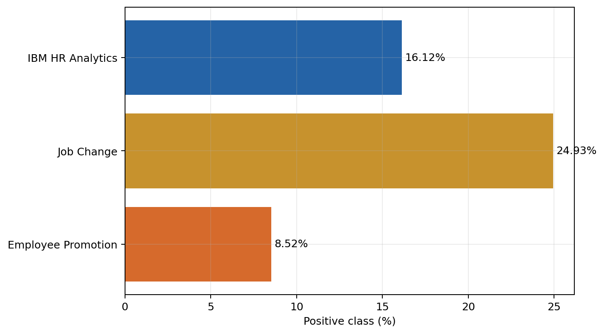
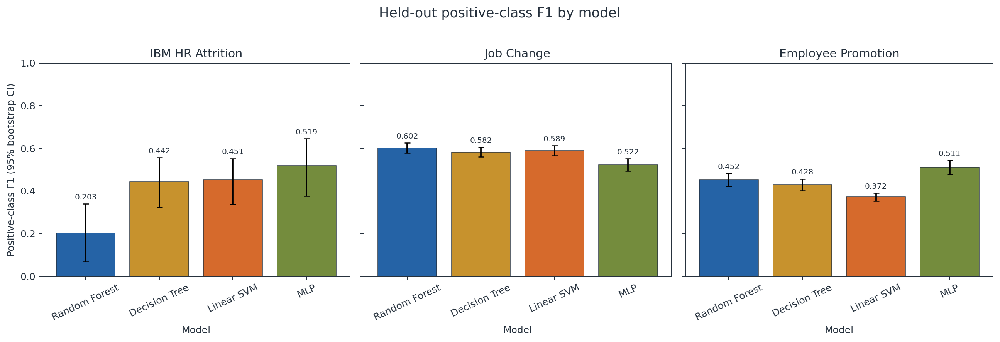
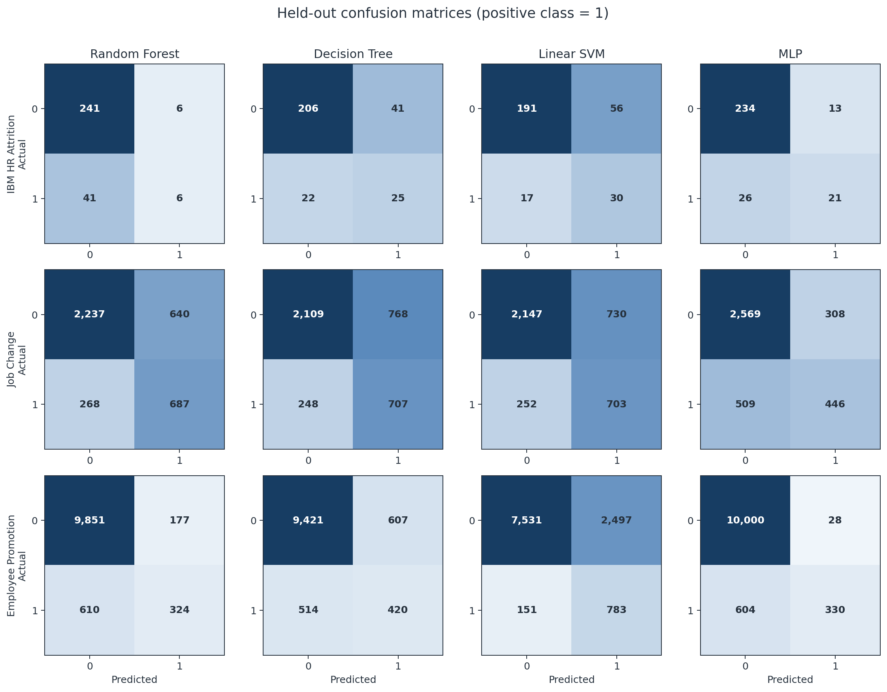
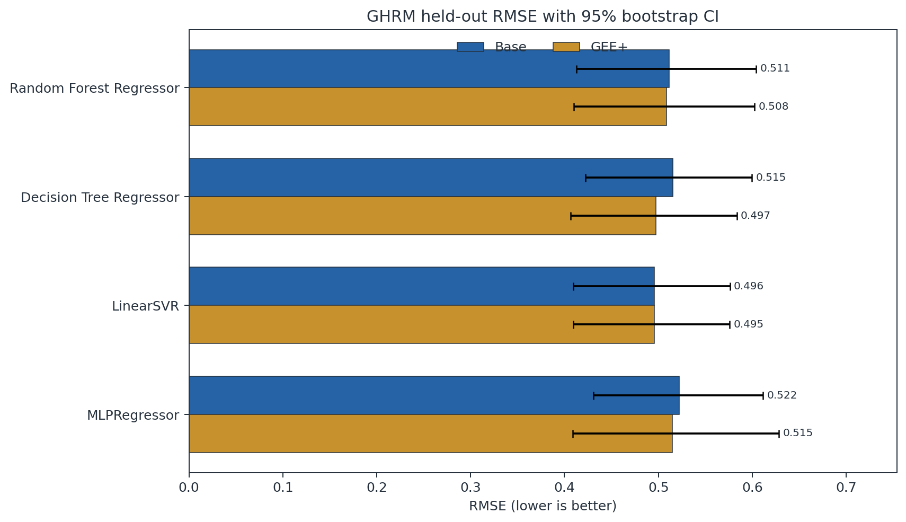
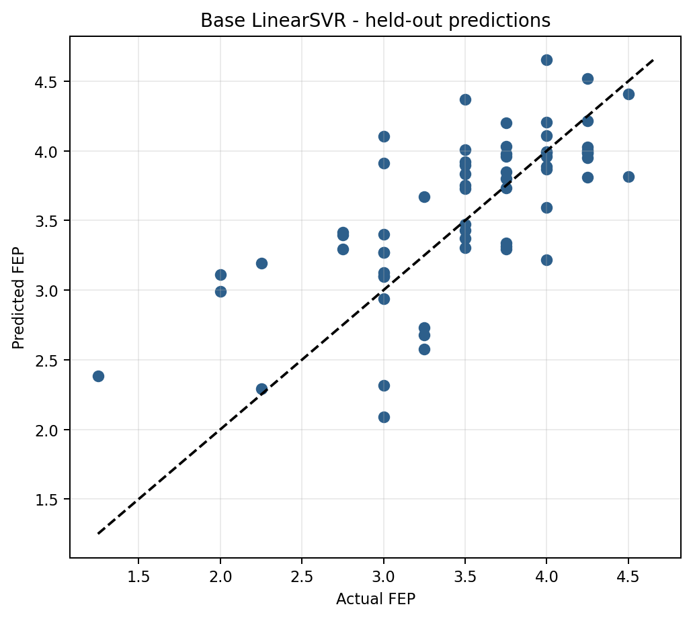
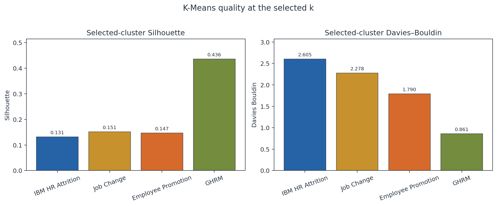
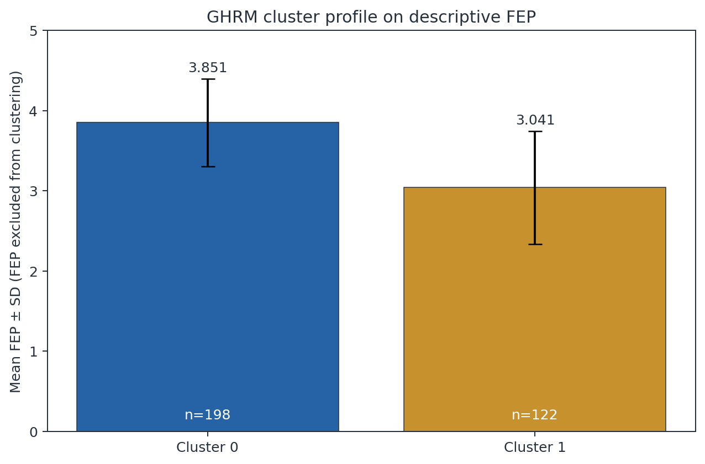

# نتایج بازتولیدپذیر فصل چهارم

این صفحه از آرتیفکت‌های اجرای کامل `python run_all.py` ساخته شده است. جدول‌ها، نمودارها و متن نتیجه‌گیری همگی برنامه‌وار به‌روز می‌شوند. همه اعداد این گزارش فارسی هستند و نشان اعشار به‌صورت `.` نوشته شده است.

## طرح تحلیل و کیفیت داده

| مجموعه‌داده | تعداد رکورد | ستون خام | متغیر هدف | نوع مسئله | سهم کلاس مثبت |
| --- | --- | --- | --- | --- | --- |
| IBM HR Attrition | ۱,۴۷۰ | ۳۵ | Attrition | Binary classification | ۱۶.۱۲% |
| Job Change | ۱۹,۱۵۸ | ۱۴ | target | Binary classification | ۲۴.۹۳% |
| Employee Promotion | ۵۴,۸۰۸ | ۱۴ | is_promoted | Binary classification | ۸.۵۲% |
| GHRM–Environmental Performance | ۳۲۰ | ۳۳ | FEP (derived mean score) | Regression | — |

چهار منبع داده مستقل اند و هیچ رکوردی میان آن‌ها ادغام نشده است. کنترل کیفیت شامل ردیف تکراری، هدف گمشده و شناسه تکراری/گمشده بود. بیشترین نسبت‌های گمشدگی: `company_type` در Job Change (۳۲.۰۴۹۳٪)، `company_size` در Job Change (۳۰.۹۹۴۹٪)، `gender` در Job Change (۲۳.۵۳۰۶٪)، `major_discipline` در Job Change (۱۴.۶۸۳۲٪). جایگذاری فقط داخل fold آموزشی انجام شد.



## نتایج طبقه‌بندی

Precision، Recall و F1 مربوط به کلاس مثبت هستند. سهم کلاس مثبت IBM برابر ۱۶.۱۲۲۴٪ و Employee Promotion برابر ۸.۵۱۷۰٪ است؛ پس Accuracy به‌تنهایی ملاک مناسبی نیست. بازه‌های اطمینان ۹۵٪ با ۲٬۰۰۰ بازنمونه‌گیری bootstrap از مجموعه آزمون محاسبه شدند.

| مجموعه‌داده | مدل | Accuracy | Precision مثبت | Recall مثبت | F1 مثبت | حد پایین F1 | حد بالای F1 | بهترین F1 در CV |
| --- | --- | --- | --- | --- | --- | --- | --- | --- |
| IBM HR Attrition | Random Forest | ۰.۸۴۰۱ | ۰.۵۰۰۰ | ۰.۱۲۷۷ | ۰.۲۰۳۴ | ۰.۰۶۸۹ | ۰.۳۳۹۶ | ۰.۳۳۸۴ |
| IBM HR Attrition | Decision Tree | ۰.۷۸۵۷ | ۰.۳۷۸۸ | ۰.۵۳۱۹ | ۰.۴۴۲۵ | ۰.۳۲۴۳ | ۰.۵۵۶۵ | ۰.۳۶۵۳ |
| IBM HR Attrition | Linear SVM | ۰.۷۵۱۷ | ۰.۳۴۸۸ | ۰.۶۳۸۳ | ۰.۴۵۱۱ | ۰.۳۳۸۷ | ۰.۵۵۱۷ | ۰.۴۸۶۲ |
| IBM HR Attrition | MLP | ۰.۸۶۷۳ | ۰.۶۱۷۶ | ۰.۴۴۶۸ | ۰.۵۱۸۵ | ۰.۳۷۶۴ | ۰.۶۴۴۵ | ۰.۵۴۸۹ |
| Job Change | Random Forest | ۰.۷۶۳۰ | ۰.۵۱۷۷ | ۰.۷۱۹۴ | ۰.۶۰۲۱ | ۰.۵۷۸۰ | ۰.۶۲۴۷ | ۰.۵۷۷۰ |
| Job Change | Decision Tree | ۰.۷۳۴۹ | ۰.۴۷۹۳ | ۰.۷۴۰۳ | ۰.۵۸۱۹ | ۰.۵۵۹۵ | ۰.۶۰۴۸ | ۰.۵۶۴۲ |
| Job Change | Linear SVM | ۰.۷۴۳۷ | ۰.۴۹۰۶ | ۰.۷۳۶۱ | ۰.۵۸۸۸ | ۰.۵۶۵۷ | ۰.۶۱۲۳ | ۰.۵۷۱۲ |
| Job Change | MLP | ۰.۷۸۶۸ | ۰.۵۹۱۵ | ۰.۴۶۷۰ | ۰.۵۲۱۹ | ۰.۴۹۲۶ | ۰.۵۵۰۹ | ۰.۴۸۹۰ |
| Employee Promotion | Random Forest | ۰.۹۲۸۲ | ۰.۶۴۶۷ | ۰.۳۴۶۹ | ۰.۴۵۱۶ | ۰.۴۲۰۸ | ۰.۴۸۲۲ | ۰.۴۴۷۷ |
| Employee Promotion | Decision Tree | ۰.۸۹۷۷ | ۰.۴۰۹۰ | ۰.۴۴۹۷ | ۰.۴۲۸۴ | ۰.۴۰۱۹ | ۰.۴۵۵۹ | ۰.۴۳۷۲ |
| Employee Promotion | Linear SVM | ۰.۷۵۸۴ | ۰.۲۳۸۷ | ۰.۸۳۸۳ | ۰.۳۷۱۶ | ۰.۳۵۳۱ | ۰.۳۹۰۱ | ۰.۳۶۹۴ |
| Employee Promotion | MLP | ۰.۹۴۲۳ | ۰.۹۲۱۸ | ۰.۳۵۳۳ | ۰.۵۱۰۸ | ۰.۴۷۷۱ | ۰.۵۴۳۳ | ۰.۴۹۸۳ |

در IBM HR Attrition، **MLP** با F1 مثبت **۰.۵۱۸۵** (بازه اطمینان ۹۵٪: ۰.۳۷۶۴ تا ۰.۶۴۴۵) بهترین F1 را داشت؛ بیشترین Recall مثبت نیز مربوط به Linear SVM با مقدار ۰.۶۳۸۳ بود.

در Job Change، **Random Forest** با F1 مثبت **۰.۶۰۲۱** (بازه اطمینان ۹۵٪: ۰.۵۷۸۰ تا ۰.۶۲۴۷) بهترین F1 را داشت؛ بیشترین Recall مثبت نیز مربوط به Decision Tree با مقدار ۰.۷۴۰۳ بود.

در Employee Promotion، **MLP** با F1 مثبت **۰.۵۱۰۸** (بازه اطمینان ۹۵٪: ۰.۴۷۷۱ تا ۰.۵۴۳۳) بهترین F1 را داشت؛ بیشترین Recall مثبت نیز مربوط به Linear SVM با مقدار ۰.۸۳۸۳ بود.





## آزمون McNemar

| مجموعه‌داده | مدل A | مدل B | b01 | b10 | p-value |
| --- | --- | --- | --- | --- | --- |
| IBM HR Attrition | Random Forest | Decision Tree | ۳۷ | ۲۱ | ۰.۰۴۸۹ |
| IBM HR Attrition | Random Forest | Linear SVM | ۵۲ | ۲۶ | ۰.۰۰۴۶ |
| IBM HR Attrition | Random Forest | MLP | ۱۱ | ۱۹ | ۰.۲۰۱۲ |
| Job Change | Random Forest | Decision Tree | ۲۱۱ | ۱۰۳ | <۰.۰۰۰۱ |
| Job Change | Random Forest | Linear SVM | ۲۱۴ | ۱۴۰ | ۰.۰۰۰۱ |
| Job Change | Random Forest | MLP | ۲۴۴ | ۳۳۵ | ۰.۰۰۰۲ |
| Employee Promotion | Random Forest | Decision Tree | ۵۴۳ | ۲۰۹ | <۰.۰۰۰۱ |
| Employee Promotion | Random Forest | Linear SVM | ۲,۳۴۷ | ۴۸۶ | <۰.۰۰۰۱ |
| Employee Promotion | Random Forest | MLP | ۶۷ | ۲۲۲ | <۰.۰۰۰۱ |

این آزمون الگوی درست/نادرست پیش‌بینی‌های جفت‌شده را می‌سنجد و آزمون مستقیم اختلاف F1 نیست. مقایسه‌های نامعنادار در سطح ۰.۰۵: IBM HR Attrition: Random Forest در برابر MLP (p=۰.۲۰۱۲).

## نتایج رگرسیون GHRM

نسخه پایه از `GRS`، `GTD`، `GPA` و `GCM` و نسخه `GEE+` از متغیر اضافی `GEE` نیز استفاده می‌کند. بازه‌های اطمینان با ۴٬۰۰۰ بازنمونه‌گیری محاسبه شدند.

| نسخه | مدل | R² | حد پایین R² | حد بالای R² | MAE | RMSE | حد پایین RMSE | حد بالای RMSE | CV RMSE |
| --- | --- | --- | --- | --- | --- | --- | --- | --- | --- |
| Base | Random Forest Regressor | ۰.۳۷۹۸ | ۰.۰۲۴۵ | ۰.۶۰۱۶ | ۰.۳۹۳۸ | ۰.۵۱۱۴ | ۰.۴۱۲۷ | ۰.۶۰۴۲ | ۰.۵۵۶۳ |
| Base | Decision Tree Regressor | ۰.۳۶۹۸ | -۰.۰۴۶۶ | ۰.۶۲۴۶ | ۰.۳۹۴۲ | ۰.۵۱۵۵ | ۰.۴۲۲۳ | ۰.۵۹۹۴ | ۰.۵۸۹۲ |
| Base | LinearSVR | ۰.۴۱۷۱ | ۰.۱۱۹۳ | ۰.۵۸۸۸ | ۰.۳۸۵۹ | ۰.۴۹۵۸ | ۰.۴۰۹۵ | ۰.۵۷۶۱ | ۰.۵۳۱۲ |
| Base | MLPRegressor | ۰.۳۵۳۴ | ۰.۰۳۰۹ | ۰.۵۲۹۶ | ۰.۴۱۷۲ | ۰.۵۲۲۲ | ۰.۴۳۰۸ | ۰.۶۱۱۵ | ۰.۵۹۲۸ |
| GEE+ | Random Forest Regressor | ۰.۳۸۶۸ | ۰.۰۴۱۷ | ۰.۶۰۰۹ | ۰.۳۹۳۹ | ۰.۵۰۸۵ | ۰.۴۱۰۰ | ۰.۶۰۲۶ | ۰.۵۵۵۶ |
| GEE+ | Decision Tree Regressor | ۰.۴۱۳۴ | ۰.۰۳۴۳ | ۰.۶۴۳۹ | ۰.۳۸۴۸ | ۰.۴۹۷۳ | ۰.۴۰۶۷ | ۰.۵۸۳۴ | ۰.۶۰۷۳ |
| GEE+ | LinearSVR | ۰.۴۱۷۸ | ۰.۱۰۹۲ | ۰.۵۹۵۹ | ۰.۳۸۴۷ | ۰.۴۹۵۵ | ۰.۴۰۹۱ | ۰.۵۷۵۶ | ۰.۵۳۵۰ |
| GEE+ | MLPRegressor | ۰.۳۷۱۲ | ۰.۰۹۶۱ | ۰.۵۳۷۴ | ۰.۳۹۶۷ | ۰.۵۱۴۹ | ۰.۴۰۸۹ | ۰.۶۲۸۴ | ۰.۵۷۰۰ |

بهترین مدل پایه **LinearSVR** با R²=۰.۴۱۷۱ و RMSE=۰.۴۹۵۸ بود. بهترین مدل GEE+ نیز **LinearSVR** با R²=۰.۴۱۷۸ و RMSE=۰.۴۹۵۵ بود.

### مقایسه جفت‌شده افزودن GEE

| مدل | تغییر R² | حد پایین تغییر R² | حد بالای تغییر R² | تغییر RMSE | حد پایین تغییر RMSE | حد بالای تغییر RMSE |
| --- | --- | --- | --- | --- | --- | --- |
| Random Forest Regressor | ۰.۰۰۷۱ | -۰.۰۴۴۰ | ۰.۰۶۴۴ | -۰.۰۰۲۹ | -۰.۰۲۳۶ | ۰.۰۱۷۰ |
| Decision Tree Regressor | ۰.۰۴۳۶ | -۰.۰۳۵۵ | ۰.۱۶۱۳ | -۰.۰۱۸۱ | -۰.۰۵۵۵ | ۰.۰۱۴۲ |
| LinearSVR | ۰.۰۰۰۷ | -۰.۰۱۷۸ | ۰.۰۱۴۱ | -۰.۰۰۰۳ | -۰.۰۰۶۹ | ۰.۰۰۵۹ |
| MLPRegressor | ۰.۰۱۷۸ | -۰.۰۸۰۶ | ۰.۱۵۲۶ | -۰.۰۰۷۳ | -۰.۰۵۰۸ | ۰.۰۳۸۱ |

برای LinearSVR، تغییر R² برابر ۰.۰۰۰۷ و بازه اطمینان آن -۰.۰۱۷۸ تا ۰.۰۱۴۱ است. این بازه شامل صفر است؛ بنابراین برتری پایدار GEE تأیید نمی‌شود. این تحلیل پیش‌بینانه است و میانجی‌گری یا علیت را آزمون نمی‌کند.





## نتایج خوشه‌بندی K-Means

هدف و شناسه‌ها در سه داده عمومی و `FEP` در GHRM از تشکیل خوشه حذف شدند. چون K-Means فاصله اقلیدسی را روی اعداد استاندارد و متغیرهای رده‌ای one-hot اعمال می‌کند، خوشه‌ها صرفاً اکتشافی هستند.

| مجموعه‌داده | k منتخب | Silhouette | Davies–Bouldin | n برای Silhouette | تفسیر |
| --- | --- | --- | --- | --- | --- |
| IBM HR Attrition | ۲ | ۰.۱۳۱۳ | ۲.۶۰۵۴ | ۱,۴۷۰ | تفکیک اکتشافی ضعیف |
| Job Change | ۲ | ۰.۱۵۱۳ | ۲.۲۷۷۸ | ۵,۰۰۰ | تفکیک اکتشافی ضعیف |
| Employee Promotion | ۵ | ۰.۱۴۷۳ | ۱.۷۹۰۲ | ۵,۰۰۰ | تفکیک اکتشافی ضعیف |
| GHRM–Environmental Performance | ۲ | ۰.۴۳۶۳ | ۰.۸۶۱۱ | ۳۲۰ | تفکیک اکتشافی متوسط |

برای IBM HR Attrition، k=۲ با Silhouette=۰.۱۳۱۳ و Davies–Bouldin=۲.۶۰۵۴ منتخب شد؛ Silhouette روی ۱,۴۷۰ رکورد محاسبه شد.

برای Job Change، k=۲ با Silhouette=۰.۱۵۱۳ و Davies–Bouldin=۲.۲۷۷۸ منتخب شد؛ Silhouette روی ۵,۰۰۰ رکورد محاسبه شد.

برای Employee Promotion، k=۵ با Silhouette=۰.۱۴۷۳ و Davies–Bouldin=۱.۷۹۰۲ منتخب شد؛ Silhouette روی ۵,۰۰۰ رکورد محاسبه شد.

برای GHRM–Environmental Performance، k=۲ با Silhouette=۰.۴۳۶۳ و Davies–Bouldin=۰.۸۶۱۱ منتخب شد؛ Silhouette روی ۳۲۰ رکورد محاسبه شد.

### اندازه همه خوشه‌ها

| مجموعه‌داده | خوشه | تعداد |
| --- | --- | --- |
| IBM HR Attrition | ۰ | ۹۹۵ |
| IBM HR Attrition | ۱ | ۴۷۵ |
| Job Change | ۰ | ۱۳,۴۹۶ |
| Job Change | ۱ | ۵,۶۶۲ |
| Employee Promotion | ۰ | ۷,۲۲۷ |
| Employee Promotion | ۱ | ۲۲,۵۶۸ |
| Employee Promotion | ۲ | ۱,۲۷۰ |
| Employee Promotion | ۳ | ۷,۵۸۶ |
| Employee Promotion | ۴ | ۱۶,۱۵۷ |
| GHRM–Environmental Performance | ۰ | ۱۹۸ |
| GHRM–Environmental Performance | ۱ | ۱۲۲ |



### پروفایل توصیفی خوشه‌های GHRM

| خوشه | تعداد | میانگین FEP | انحراف معیار FEP |
| --- | --- | --- | --- |
| ۰ | ۱۹۸ | ۳.۸۵۱۰ | ۰.۵۴۷۲ |
| ۱ | ۱۲۲ | ۳.۰۴۱۰ | ۰.۷۰۳۷ |

خوشه ۰ با ۱۹۸ مشاهده و میانگین FEP=۳.۸۵۱۰، خوشه ۱ با ۱۲۲ مشاهده و میانگین FEP=۳.۰۴۱۰. چون FEP در تشکیل خوشه وارد نشد، این مقایسه فقط پروفایل پس از خوشه‌بندی است.



نمودارهای تشخیصی: [IBM](figures/kmeans_ibm_diagnostics.png)، [Job Change](figures/kmeans_job_change_diagnostics.png)، [Employee Promotion](figures/kmeans_promotion_diagnostics.png)، [GHRM](figures/kmeans_ghrm_diagnostics.png).

## محدودیت‌ها

1. یک تفکیک ثابت ۸۰/۲۰ نماینده همه تفکیک‌های ممکن نیست؛ بازه‌های bootstrap عدم‌قطعیت مجموعه آزمون را نشان می‌دهند، نه اعتبارسنجی بیرونی را.
2. سه داده عمومی سنجه مستقیم GHRM ندارند و نباید خوشه‌های آن‌ها را سبز/غیرسبز نامگذاری کرد.
3. نتایج ماهیت پیش‌بینانه یا اکتشافی دارند و علیت یا میانجی‌گری را اثبات نمی‌کنند.
4. تعمیم به سازمان، صنعت یا کشور دیگر به اعتبارسنجی بیرونی نیاز دارد.

## بازتولید و اعتبارسنجی

```bash
python -m pip install -r requirements.txt
python run_all.py
python -m unittest discover -s tests -v
python scripts/validate_published_results.py
```

جدول‌های ماشین‌خوان در [`results/tables`](tables/) و نمودارها در [`results/figures`](figures/) قرار دارند.
